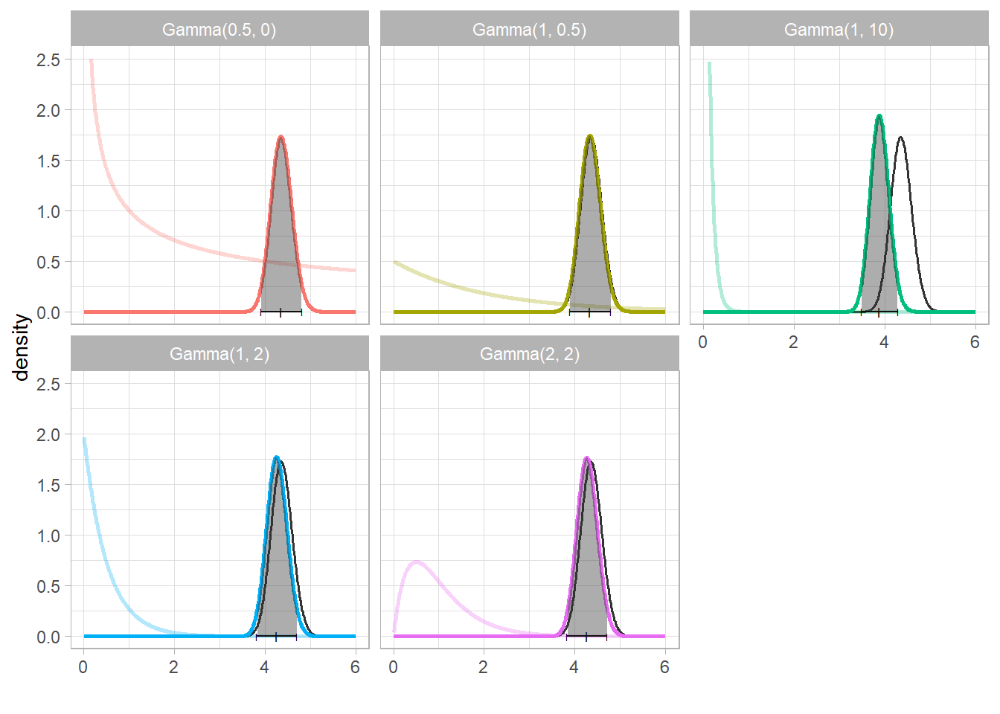

# Bayesian Statistics Homeworks
Homeworks from the Bayesian Statistics course of accademic year 2018/2019 at University of Trieste.

In folder [assignments](https://github.com/stinco/bayesian-statistics-homeworks/tree/master/assignments) you can find the three assignments given by the teachers in `.html` files.

In folder [solutions](https://github.com/stinco/bayesian-statistics-homeworks/tree/master/solutions) you can find my solutions. For each assignment, there is both a `.html` file with my report and a `.Rmd` file with the code. The other subfolders are needed to compile the `.Rmd` files.
