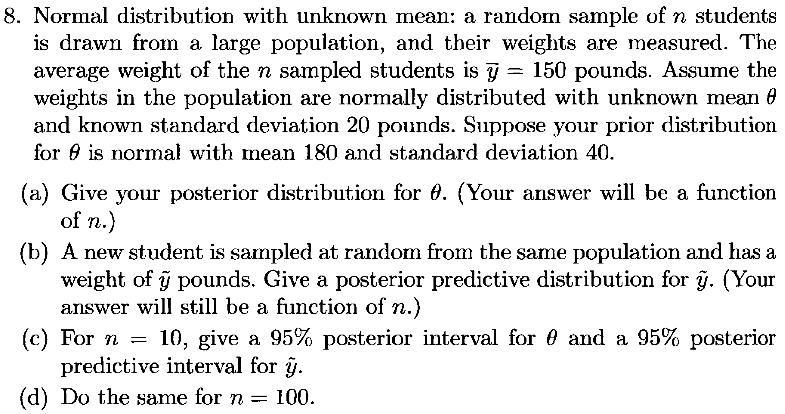

\newcommand*\diff{\mathop{}\mathrm{d}}

```{r setup, include=FALSE}
knitr::opts_chunk$set(echo = TRUE, fig.align='center')
```

## TH-1

_**Assignment**: Linear regression slides, slide 20: fit the same model with the function `bayesglm()` of the `arm` package and comment. Then, use an informative prior and comment the results._

```{r, libraries, message = F}
# Libraries
library(arm)
library(tidyverse)
library(latex2exp)
library(AER)
library(HDInterval)
library(knitr)
library(kableExtra) # For kable style table
```

In the following chunk I estimated the coefficients $(\beta_0, \beta_1)$ of the model $E\left[Y|X=x\right]=\beta_0+\beta_1x$ with the following methods:

1. the classical maximum likelihood estimator;
2. the Bayesian estimator with a non informative prior;
3. the Bayesian estimator with a prior informative over $\beta_1$.

As a non informative prior for the 2nd model I used:
$$
(\beta_0, \beta_1)\sim\mathcal{N}^{(2)}\left(\boldsymbol{\mu}, \Sigma \right)
$$

with:
$$
\boldsymbol{\mu}=
{0 \choose 0}
$$
and:
$$
\Sigma = 
\left(
\begin{matrix}
+\infty & 0 \\
0       & +\infty \\
\end{matrix}
\right)
$$
This prior corresponds to a uniform non informative prior $Unif(-\infty, +\infty)$ for both $\beta_0$ and $\beta_1$ . This is an improper distribution. The fact that $\boldsymbol{\mu}={0 \choose 0}$ is irrelevant. I could have chosen any value for $\mu$ and I still have gotten the same uniform improper distribution as a degenerated normal.

As an informative prior for the 3rd model I used:
$$
(\beta_0, \beta_1)\sim\mathcal{N}^{(2)}\left(\boldsymbol{\mu}, \Sigma \right)
$$

with:
$$
\boldsymbol{\mu}=
{0 \choose 0}
$$
and:
$$
\Sigma = 
\left(
\begin{matrix}
+\infty & 0 \\
0       & \frac{1}{100} \\
\end{matrix}
\right)
$$
This prior is non informative over $\beta_0$, but it is informative over $\beta_1$ with prior expectation $E[\beta_1]=0$ and prior variance $Var[\beta_1]=\frac{1}{100}$.


```{r, cars_modelFitting}
# Classical linear model
lm <- lm(dist~speed, data = cars)

# Bayesian linear model with non informative prior
lm_bayes <- bayesglm(dist~speed,
                     data = cars,
                     family = gaussian,
                     prior.mean = 0,
                     prior.scale = Inf,
                     prior.df = Inf,
                     prior.mean.for.intercept = 0,
                     prior.scale.for.intercept = Inf,
                     prior.df.for.intercept = Inf)

# Bayesian linear model with informative prior
lm_bayes_info <- bayesglm(dist~speed,
                          data = cars,
                          family = gaussian,
                          prior.mean = 0,
                          prior.scale = 0.01,
                          prior.df = Inf,
                          prior.mean.for.intercept = 0,
                          prior.scale.for.intercept = Inf,
                          prior.df.for.intercept = Inf)
```

In the following chunk we can see the maximum likelihood estimation and the maximum a posteriori estimation with the non informative and the informative priors.

As we can see, the maximum a posteriori estimation $\hat{\beta}^{MP}_1$ with the non-informative prior corresponds to the maximum likelihood estimation $\hat{\beta}_1$. This is due to the fact that, if the prior is: $\pi(\theta)\propto k, \ k\in]0,+\infty[$, the posterior results:
$$
\pi(\theta|y)\propto p(y|\theta)\pi(\theta)\propto p(y|\theta)
$$
Then, as soon as the posterior $\pi(\theta|y)$ is proportional to the likelihood $p(y|\theta)$, we get:
$$
\mathrm{argmax}_{\theta\in\Theta}\left\{\pi(\theta|y)\right\}
=
\mathrm{argmax}_{\theta\in\Theta}\left\{p(y|\theta)\right\}
$$
In the maximum a posteriori estimation with the informative prior with $E[\beta_1]=0$, we got a smaller value for $\hat{\beta}^{MP}_1$. This is due to the fact that the maximum a posteriori estimation $\hat{\beta}^{MP}_1$ is a weighted average of $E[\beta_1]$ and $\hat{\beta}_1$ (where $\hat{\beta}_1$ is the maximum likelihood estimation). So the prior distribution over $\beta_1$ leads to a shrinkage toward 0 of the maximum a posteriori estimation $\hat{\beta}^{MP}_1$.


```{r cars_modelShow}
# Classical linear model
summary(lm)
# Bayesian linear model with non informative prior
display(lm_bayes)
# Bayesian linear model with informative prior
display(lm_bayes_info)
```

In the following plot we can see the estimated regression lines for the maximum likelihood estimation $y=\hat{\beta}_0+\hat{\beta}_1x$ (that corresponds to the maximum a posteriori with the non informative prior) and the maximum a posteriori estimation with the informative prior $y=\hat{\beta}^{MP}_0+\hat{\beta}^{MP}_1x$.

As we can see, the maximum a posteriori regression line is less sloped because $\hat{\beta}^{MP}_1$ is closer to 0 than $\hat{\beta}_1$.


```{r, cars_plot}
plot(cars$speed, cars$dist,
     xlab = "speed", ylab = "distance",
     main = "Bayesian linear regression with informative and non informative prior")

abline(a = lm$coefficients[1],
       b = lm$coefficients[2],
       col = "red")

abline(a = lm_bayes_info$coefficients[1],
       b = lm_bayes_info$coefficients[2],
       col = "blue")

legend("topleft",
       legend = c("Non-informative prior", "Informative prior"),
       col = c("red", "blue"),
       lty = 1)
```


## BDA-1
_**Assignment**: Noninformative prior densities:_

a. _For the binomial likelihood $y\sim Binom(n,\theta)$, show that $p(\theta)\propto \theta^{-1}(1-\theta)^{-1}$ is the uniform prior distribution for the natural parameter of the exponential family._
b. _Show that if $y=0$ or $n$, the resulting posterior distributution is improper._

### a.

#### Notation 

In order not to create ambiguity, I changed the notation using $p$ instead of $\theta$ for the probability of success in the Binomial distribution. I used $\theta$ as the canonical parameter for the exponential reparametrization as used in _La tariffazione nei rami danni con modelli lineari generalizzati (P. Gigante, L. Picech, L. Sigalotti)_.

Furthermore I'm using $\pi_p(\cdot)$ to refer to the density function of the parameter $p$ and $\pi_\theta(\cdot)$ to refer to the corresponding density function of the parameter $\theta$.

So, assuming that:
$$
y\sim Binom(n,p)
$$
We must prove that if $\pi_\theta(\theta)\propto k, \ k\in ]0, +\infty[$, it results:
$$
\pi_p(p)\propto p^{-1}(1-p)^{-1}
$$

An exponential family is a parametrical family of distribution $\mathcal{F}$ in which the probability function can be expressed as:

$$
f(y;\theta,\phi,\omega) = \exp{\left\{
\frac{\omega}{\phi}\left[
y\theta-b(\theta)
\right]
\right\}}
c(y,\phi,\omega)
$$
where:

* $\theta\in\Theta\subset\mathbb{R}$ is the canonical parameter;
* $\phi>0$ is the dispersion parameter;
* $\omega$ is the weight.

The probability function of the Binomial distribution can be expressed as:
$$
p_Y(y|p) = {n \choose y}p^y(1-p)^{n-y} =
\exp{\left[
n\left(
\frac{y}{n}
\underbrace{\log{\frac{p}{1-p}}}_{=\theta}
-\log{\frac{1}{1-p}}
\right)
\right]}
{n \choose y}
=
\exp{\left[
n\left(
\frac{y}{n}
\theta
-\log{\left(1+e^{\theta}\right)}
\right)
\right]}
{n \choose y}
$$
So the scaled Binomial distribution $Y/n\sim Binom(n,p)/n$ is an exponential family with
$$
\theta = 
g(p) =
\log{\frac{p}{1-p}}
$$
$g(\cdot)$ is called link function.

The inverse of $g(\cdot)$ can be expressed as:
$$
p = g^{-1}(\theta) = r(\theta) = \frac{e^{\theta}}{1+e^{\theta}}
$$
$r(\theta)$ is called response function.

As soon as the probability of success $p$ is defined in $[0,1]$, the canonical parameter $\theta$ is defined over the whole $\mathbb{R}$. Therefore, the prior distribution $\theta$ is $\pi_\theta(\theta)\propto k, \ k\in]0,+\infty[$ is an improper distribution.


#### Demonstration

Assuming that the prior distribution for $\theta$ is $\pi_\theta(\theta)\propto k, \ k\in]0,+\infty[$, we can find $\pi_p(p)$ as:

$$
\begin{aligned}
\pi_p(p) &= \pi_\theta\left(r^{-1}(p)\right) \ r^{-1\prime}(p) \\
         &= \pi_\theta\left(g(p)\right) \ g^{\prime}(p)
\end{aligned}
$$
As soon as $g^\prime(p)=p^{-1}(1-p)^{-1}$, we got

$$
\begin{aligned}
\pi_p(p) &= \pi_\theta\left(g(p)\right) \ g^{\prime}(p) \\
         &\propto k \ p^{-1}(1-p)^{-1} \\
         &\propto p^{-1}(1-p)^{-1}
\end{aligned}
$$

We can show that $\pi_p(p)\propto p^{-1}(1-p)^{-1}$ is an improper distribution, because:
$$
\int_0^1{\pi_p(p) \diff p} = +\infty
$$
Computing the indefinite integral we get:
$$
\begin{aligned}
\int{\pi_p(p) \diff p} &= \int{\frac{1}{p(1-p)} \diff p} \\
                       &= \int{\left(\frac{1}{p} + \frac{1}{1-p}\right) \diff p} \\
                       &= \log{p} - \log{\left(1-p\right)} \\
                       &= \log{\frac{p}{1-p}}
\end{aligned}
$$
For the symmetry of $\pi_p(p)$ around $\frac12$, we can compute the definite integral as:
$$
\int_0^1{\pi_p(p) \diff p} = 2\cdot\int_0^{\frac12}{\pi_p(p) \diff p}
$$
Se we get:
$$
\begin{aligned}
\int_0^1{\pi_p(p) \diff p} &= 2\cdot \left[\log{\frac{p}{1-p}}\right]_0^{\frac{1}{2}} \\
                           &= 2\cdot \left(0 - \lim_{p\to 0^+}{\log{\frac{p}{1-p}}} \right) \\
                           &= +\infty
\end{aligned}
$$

#### Note

Note that we can see $\pi_p(p) = \propto p^{-1}(1-p)^{-1}$ as an improper _Beta_ distribution with parameters $\alpha = 0$ and $\beta = 0$. This is an improper distribution because in the _Beta_ distribution the parameters should be $\alpha>0$, $\beta>0$. If $\alpha=0$ or $\beta=0$ it is an improper distribution because:
$$
\int_0^1{x^{\alpha-1}(1-x)^{\beta-1} \diff p}=+\infty, \quad \mbox{if } \alpha=0 \lor \beta=0
$$


### b.

#### Demonstration

The resulting posterior for $p$ is:
$$
\begin{aligned}
\pi_p(p|y) &\propto p(y|p) \ \pi_p(p) \\
           &\propto {n \choose y} p^y (1-p)^{n-y} \ p^{-1} (1-p)^{-1} \\
           &\propto {n \choose y} p^{y-1} (1-p)^{n-y-1} \\
           &\propto p^{y-1} (1-p)^{n-y-1}
\end{aligned}
$$

We can see that if $y\in\{ 1, 2, \cdot, n-1 \}$, $p^{y-1} (1-p)^{n-y-1}$ is the kernel of a $Beta(y, n-y)$, so:
$$
\int_0^1{p^{y-1} (1-p)^{n-y-1} \diff p} = \frac{\Gamma(y)\Gamma(n-y)}{\Gamma(n)}
$$
So $\pi_p(p|y)$ is a proper distribution and:
$$
\pi_p(p|y) = \frac{\Gamma(n)}{\Gamma(y)\Gamma(n-y)} {p^{y-1} (1-p)^{n-y-1}} \sim Beta(y, n-y)
$$

Let's assume $y=0$. The posterior distribution for $p$ become:
$$
\pi_p(p|y) \propto p^{-1}(1-p)^{n-1}
$$

Now we must demonstrate that:
$$
\int_0^1{p^{-1} (1-p)^{n-1} \diff p} = +\infty
$$


Note that for the symmetry of $\pi_p(p|y)$ the case $y=n$ is analogous. If we define $q=1-p$ we got:
$$
\int_0^1{p^{n-1} (1-p)^{-1}} = \int_0^1{q^{-1} (1-q)^{n-1}} 
$$
So we get the same integral as the case $y=0$.

Let's demonstrate that $\int_0^1{p^{-1} (1-p)^{n-1}} = +\infty$:
$$
\begin{aligned}
\int_0^1{\pi_p(p|y) \diff p} &\propto \int_0^1{\frac{(1-p)^{n-1}}{p} \diff p}
\end{aligned}
$$
Computing the indefinite integral we get:

$$
\begin{aligned}
\int{\frac{(1-p)^{n-1}}{p} \diff p}
                         &= \int{\frac{\sum_{i=0}^{n-1}{{n-1 \choose i}(-p)^i}}{p} \diff p} \\
                         &= \sum_{i=0}^{n-1}{{n-1 \choose i}(-1)^i \int{p^{i-1} \diff p}} \\
                         &= {n-1 \choose 0} (-1)^0 \log{p} + \sum_{i=1}^{n-1}{{n-1 \choose i}(-1)^i\frac{1}{i}p^i} \\
                         &= \log{p} + \sum_{i=1}^{n-1}{{n-1 \choose i}(-1)^i\frac{1}{i}p^i}
\end{aligned}
$$

Therefore:
$$
\begin{aligned}
\int_0^1{\pi_p(p|y) \diff p} &\propto \int_0^1{\frac{(1-p)^{n-1}}{p} \diff p} \\
&= \underbrace{\left[\log{p}\right]_0^1}_{+\infty} + \underbrace{\sum_{i=1}^{n-1}{{n-1 \choose i}(-1)^i\frac{1}{i}\left[p^{i-1}\right]_0^1}}_{\in \mathbb{R}} \\
&= +\infty
\end{aligned}
$$

So, if $y=0$ or $y=n$, $\pi_p(p|y)$ is an improper distribution.


#### Note

Note that if $y=0$ or $y=n$, as before, we fall in the case of an improper _Beta_ distribution with respectively $\alpha = 0$ or $\beta = 0$.


## BDA-2

_**Assignment**:_

```{r, out.width = "500px", echo = F}

```


### Data and notation

We have:

* $Y_i \sim \mathcal{N}\left(\theta, \ \sigma^2=20^2\right), \ i\in\{1,2,\dots, n\}$
* $\bar{y}=150$
* $\theta \sim \mathcal{N}\left( \mu_0 = 180, \ \sigma_0^2 = 40^2 \right)$


### a.

The prior distribution for $\theta$ is:

$$
\begin{aligned}
\pi(\theta) &= \frac{1}{\sqrt{2\pi\sigma_0^2}}e^{-\frac{1}{2\sigma_0^2}(\theta-\mu_0)^2} \\
            &\propto \exp{\left[-\frac{1}{2\sigma_0^2}\left( \theta^2-2\theta\mu_0 \right)\right]}
\end{aligned}
$$

The likelihood for $\boldsymbol{y}|\theta$ is:

$$
\begin{aligned}
p(\boldsymbol{y}|\theta) &= \prod_{i=1}^{n}{\frac{1}{\sqrt{2\pi\sigma^2}}e^{-\frac{1}{2\sigma^2}(y_i-\theta)^2}} \\
            &\propto \exp{\left[ -\frac{n}{2\sigma^2} \left( -2\bar{y}\theta + \theta^2 \right) \right]}
\end{aligned}
$$

Therefore, the posterior distribution $\pi(\theta|\boldsymbol{y})$ is:

$$
\begin{aligned}
\pi(\theta|\boldsymbol{y}) &\propto p(\boldsymbol{y}|\theta)\pi(\theta) \\
                           &\propto \exp{\left[
-\frac{1}{2\sigma_0^2}\left( \theta^2-2\theta\mu_0 \right)
\right]} \ 
\exp{\left[
-\frac{n}{2\sigma^2} \left( -2\bar{y}\theta + \theta^2 \right)
                           \right]} \\
                           &\propto \exp{\left[
-\frac12\left( \theta^2\left(\frac{1}{\sigma_0^2}+\frac{n}{\sigma^2}\right)
- 2\theta \left( \frac{\mu_0}{\sigma_0^2} + \frac{n \bar{y}}{\sigma^2} \right) \right)
                           \right]} \\
                           &\propto \exp{\left[
-\frac12 \left(\frac{1}{\sigma_0^2}+\frac{n}{\sigma^2}\right)
\left(\theta^2 - 2\theta \frac{\frac{\mu_0}{\sigma_0^2} + \frac{n \bar{y}}{\sigma^2}}{\frac{1}{\sigma_0^2}+\frac{n}{\sigma^2}}  \right)
                           \right]} \\
                           &\propto \exp{\left[
-\frac1{2\sigma_n^2}\left( \theta^2 - 2\theta \mu_n \right)
                           \right]} \\
                           &\propto \exp{\left[
-\frac1{2\sigma_n^2}\left( \theta - \mu_n \right)^2
                           \right]} \\
\end{aligned}
$$

Where:
$$
\begin{aligned}
\mu_n &=
\frac{\mu_0\frac{1}{\sigma_0^2} + \bar{y} \frac{n}{\sigma^2}}{\frac{1}{\sigma_0^2} + \frac{n}{\sigma^2}} \\
\\[10pt]
\frac{1}{\sigma_n^2} &=
\frac{1}{\sigma_0^2} + \frac{n}{\sigma^2}
\end{aligned}
$$

So the posterior distribution for $\theta|\boldsymbol{y}$ is:
$$
\theta|\boldsymbol{y} \sim \mathcal{N}\left( \mu_n, \sigma_n^2 \right)
$$

Where:

* $\mu_n$ is a weighted mean of $\mu_0$ and $\bar{y}$ with weights $\frac{1}{\sigma_0^2}$ and $\frac{n}{\sigma^2}$;
* $\sigma_n^2$ is the harmonic mean of $\sigma_0^2$ (i.e. the prior variance of $\theta$) and $\frac{\sigma^2}{n}$ (i.e. the variance of $\bar{y}$).

As soon as $\mu_0=180$, $\sigma_0^2=40^2$, $\sigma^2=20$ and $\bar{y}=150$ are known, we get:

$$
\begin{aligned}
\mu_n &=
\frac{\mu_0\frac{1}{\sigma_0^2} + \bar{y} \frac{n}{\sigma^2}}{\frac{1}{\sigma_0^2} + \frac{n}{\sigma^2}} \\
&=
\frac{180\frac{1}{40^2} + 150 \frac{n}{20^2}}{\frac{1}{40^2} + \frac{n}{20^2}} \\
&=
60\frac{10n+3}{4n+1} \\
\\[10pt]
\sigma_n^2 &= \frac{\sigma_0^2 \sigma^2}{n\sigma_0^2+\sigma^2} \\
&= 
\frac{40^2 20^2}{n 40^2+20^2} \\
&= 
\frac{1600}{4n+1}
\end{aligned}
$$

Therefore:

* $(n, \mu_n)$ is an hyperbola that pass through $(0 , \mu_0)$ and has as horizontal asymptote $f(n) = \bar{y}$;
* $(n, \sigma_n^2)$ is an hyperbola that pass through $(0, \sigma_0^2)$ and has as horizontal asymptote $f(n) = 0$.


### b.

We can compute the distribution of $\tilde{y}|\boldsymbol{y}$ decomposing over the values of $\theta$:
$$
\begin{aligned}
p(\tilde{y}|\boldsymbol{y}) &= \int_{\Theta} \underbrace{p(\tilde{y}|\theta, \boldsymbol{y})}_{p(\tilde{y}|\theta)} \pi(\theta|\boldsymbol{y}) \diff \theta
\end{aligned}
$$

So $\tilde{y}|\boldsymbol{y}$ is a mixture of a normal distribution with mixturer normal:

$$
\begin{aligned}
\tilde{y}|\theta      &\sim \mathcal{N}\left(\theta, \sigma^2 \right) \\
\theta|\boldsymbol{y} &\sim \mathcal{N}\left(\mu_n, \sigma_n^2 \right)
\end{aligned}
$$

So, due to the properties of the normal distribution, we get:

$$
\tilde{y}|\boldsymbol{y} \sim \mathcal{N}\left( \mu_n, \sigma^2 + \sigma_n^2 \right)
$$

Therefore:

* $\left(n, E[\tilde{y}|\boldsymbol{y}]\right)$ is the same graph of $\left(n, E[\theta|\boldsymbol{y}] \right)$;
* $\left(n, Var[\tilde{y}|\boldsymbol{y}]\right)$ is the graph $\left(n, Var[\theta|\boldsymbol{y}] \right)$ translated upward of $\sigma^2$.

```{r, n_plot, fig.height = 4, fig.width = 11}
# n = 0:20
n = seq(from = 0, to = 20, by = .01)

mu <- 60*(10*n+3)/(4*n+1)
var <- (40^2*20^2)/(n*40^2+20^2)

var_y <- var + 20^2


par(mfrow = c(1,2))

plot(n, mu,
     type = "l",
     lwd = 2,
     ylim = c(2*min(mu)-max(mu), max(mu)+.25*(max(mu)-min(mu))),
     ylab = "Mean",
     main = TeX("Mean of $\\theta$ and $\\tilde{y}$ given $y$"))

abline(h = 150, lwd = .5)

plot(n, var,
     type = "l",
     lwd = 2,
     ylim = c(2*min(var)-max(var), max(var)+.25*(max(var)-min(var))),
     ylab = "Variance",
     main = TeX("Variance of $\\theta$ and $\\tilde{y}$ given $y$"))

points(n, var_y,
       col = "red",
       type = "l",
       lwd = 2)

abline(h = 0, lwd = .5)
abline(h = 20^2, col = "red", lwd = .5)

legend(x = 15, y = 2200,
       bty = "n",
       legend = c(TeX("$\\sigma_n^2$"), TeX("$\\sigma_n^2 + \\sigma^2$")),
       col = c("black", "red"),
       lwd = 2)

par(mfrow = c(1,1))
```

### c. d.

As soon as the normal distribution is symmetric over 0 its mode, the equi-tails credibility intervals and the high posterior density credibility intervals correspond.

A posterior credibility interval for $\theta|\boldsymbol{y}$ can be computed as:
$$
\mu_n \pm \Phi\left(1-\frac{\alpha}{2}\right)\sqrt{\sigma_n^2}
$$

A posterior credibility interval for $\tilde{y}|\boldsymbol{y}$ can be computed as:
$$
\mu_n \pm \Phi\left(1-\frac{\alpha}{2}\right)\sqrt{\sigma_n^2+\sigma^2}
$$

```{r}
n = c(10, 100)

mu <- 60*(10*n+3)/(4*n+1)
var <- (40^2*20^2)/(n*40^2+20^2)
var_y <- var + 20^2

alpha = .05
tab1 <- tibble(n, mu, var) %>% 
  mutate(low = mu - pnorm(1-alpha/2)*sqrt(var),
         up = mu + pnorm(1-alpha/2)*sqrt(var))

tab2 <- tibble(n, mu, var_y) %>% 
  mutate(low = mu - pnorm(1-alpha/2)*sqrt(var_y),
         up = mu + pnorm(1-alpha/2)*sqrt(var_y))

tab1
tab2
```


The confidence intervals for $\theta|\boldsymbol{y}$ are:

* for $n=10$: $`r round(mu[1],1)` \pm `r round(sqrt(var[1]),1)`$
* for $n=100$: $`r round(mu[2],1)` \pm `r round(sqrt(var[2]),1)`$


The confidence intervals for $\tilde{y}|\boldsymbol{y}$ are:

* for $n=10$: $`r round(mu[1],1)` \pm `r round(sqrt(var_y[1]),1)`$
* for $n=100$: $`r round(mu[2],1)` \pm `r round(sqrt(var_y[2]),1)`$


## LAB-1

_**Assignment**: Repeat the lab session using the dataset `ShipAccidents` in the `AER` package._


The `ShipAccidents` dataset from the `AER` package contains the following variables:

```{r, read_ShipAccidents}
data(ShipAccidents)
data <- as_tibble(ShipAccidents)
data
```

In addition to the attribute `incidents`, that represents the number of incidents occurred for each ship and, there is an attribute `service`, that (according to the documentation) represents the _aggregate months of service_. As soon as the `service` is not the same for each ship, we should consider it as an exposure.

Considering the values that the `service` assumes, it clearly can't be the month the ship has been used. It can't be even the days the ship has been used because the maximum values would be greater than 120 years.

```{r, plot_service, warning = F, fig.width=3, fig.height=3}
summary(data$service/12)
ggplot(data, aes(x = "", y = service/12)) +
  geom_boxplot() +
  scale_y_continuous(trans = "log10") +
  labs(x = "", y = "service (years)")
```

Furthermore there are `r sum(data$service==0)` observations with `service == 0`:
```{r, zero_service}
data %>% 
  filter(service == 0)
```

So, given $Y_i$ the number of incidents for the ship $i$ and $t_i$ its exposure, we can assume that $Y_i, \ i\in\{1, 2, \dots, n\}$ comes from a Poisson process of parameter $\theta$. Under these assumptions we get:

$$
Y_i \sim \mathcal{Poisson}(t_i\theta)
$$

The likelihood for $\theta$ is:

$$
\begin{aligned}
p(\boldsymbol{y}|\theta) &= \prod_{i=1}^n{P\left(Y_i=y_i|\theta\right)} \\
                         &= \prod_{i=1}^n{\frac{(t_i\theta)^{y_i}e^{-t_i\theta}}{y_i!}} \\
                         &\propto \theta^{\sum_{i=1}^n{y_i}}e^{-\left( \sum_{i=1}^n{t_i} \right)\theta}
\end{aligned}
$$

So $p(\boldsymbol{y}|\theta)$ is proportional to the density of a $\mathcal{Gamma}\left( \sum_{i=1}^n{y_i}+1, \ \sum_{i=1}^n{t_i} \right)$.

The maximum likelihood estimator for $\theta$ is:
$$
\hat{\theta} = \frac{\sum_{i=1}^n{y_i}}{\sum_{i=1}^n{t_i}}
$$
Using as a prior distribution for $\theta$ a $\mathcal{Gamma}\left(\alpha, \beta\right)$:
$$
\pi(\theta)\propto \theta^{\alpha-1}e^{-\beta\theta}
$$

we get that the posterior distribution for $\theta$ is:
$$
\begin{aligned}
\pi(\theta|y) &\propto p(\boldsymbol{y}|\theta) \pi(\theta) \\
              &\propto 
\theta^{\sum_{i=1}^n{y_i}}e^{-\left( \sum_{i=1}^n{t_i} \right)\theta} \ 
\theta^{\alpha-1}e^{-\beta\theta} \\
              &=
\theta^{\sum_{i=1}^n{y_i}+\alpha-1}e^{-\left( \sum_{i=1}^n{t_i}+\beta \right)\theta}
\end{aligned}
$$

So, it results:
$$
\theta|\boldsymbol{y} \sim \mathcal{Gamma}\left( \sum_{i=1}^n{y_i}+\alpha, \ \sum_{i=1}^n{t_i}+\beta \right)
$$

As soon as the values for `service` where incredibly high, the likelihood and the posterior distribution for $\theta$ would be extremely concentrated on small values, so the plots wouldn't be really comprehensible.

Given that one of the aims of this homework is to interpret graphically the results and it is more a didactic exercise than a real estimation problem, I decided to change the scale of `service` dividing by $2000$. Note that the results wouldn't be the same as keeping directly `service` as exposure, because, in order to get the same results, we should rescale $\pi(\theta)$ too.

```{r}
y <- data$incidents
n <- length(y)

ti <- data$service/2000 # Rescaled exposure
t <- sum(ti)

# Maximum likelihood estimation
sum(y)/t
```

```{r, posterior_compute}
alpha = c(1, 1, 1, 2)
beta = c(.5, 2, 10, 2)

x <- seq(from = 0.01, to = 6, by = .01)

# prior distribution
prior <- tibble(x = x) %>% 
  mutate(fj = 1/sqrt(x),
         f1 = dgamma(x, alpha[1], beta[1]),
         f2 = dgamma(x, alpha[2], beta[2]),
         f3 = dgamma(x, alpha[3], beta[3]),
         f4 = dgamma(x, alpha[4], beta[4]))

prior <- prior %>% 
  gather(key = dist, value = f, fj:f4) %>% 
  select(dist, x, f)


params <- tibble(name = c("fj", "f1", "f2", "f3", "f4"),
                 alpha = c(.5, alpha),
                 beta = c(0, beta))

prior <- prior %>%
  left_join(params, by = c("dist" = "name"))

prior <- prior %>% 
  mutate(label = str_c("Gamma(",alpha, ", " , beta, ")"))


# likelihood
lh <- tibble(x = x,
             lh = dgamma(x, sum(y)+1, t))


# posterior distribution
post <- tibble(x = x) %>% 
  mutate(fj = dgamma(x, sum(y) + .5, t),
         f1 = dgamma(x, sum(y) + alpha[1], t + beta[1]),
         f2 = dgamma(x, sum(y) + alpha[2], t + beta[2]),
         f3 = dgamma(x, sum(y) + alpha[3], t + beta[3]),
         f4 = dgamma(x, sum(y) + alpha[4], t + beta[4]))

post <- post %>% 
  gather(key = dist, value = f, fj:f4) %>% 
  select(dist, x, f)

post <- post %>%
  left_join(params, by = c("dist" = "name"))

post <- post %>% 
  mutate(label = str_c("Gamma(",alpha, ", " , beta, ")"))


# Results
a <- .05

res <- params %>% 
  mutate(mean = alpha/beta,
         var = alpha/beta^2,
         alpha_post = sum(y) + alpha,
         beta_post = t + beta,
         mean_post = alpha_post / beta_post,
         var_post = alpha_post / beta_post^2,
         map = (alpha_post-1) / beta_post,
         eqt_low = qgamma(a/2, alpha_post, beta_post),
         eqt_up = qgamma(1-a/2, alpha_post, beta_post))

hpd_low <- vector(length = 5)
hpd_up <- vector(length = 5)

for(i in 1:5){
  hpd <- hdi(qgamma, shape = res$alpha_post[i], rate = res$beta_post[i], credMass = 1-a)
  hpd_low[i] <- hpd[1]
  hpd_up[i] <- hpd[2]
}

res <- res %>%
  mutate(hpd_low, hpd_up) %>% 
  mutate(label = str_c("Gamma(",alpha, ", " , beta, ")"))

post2 <- post %>% 
  select(dist, x, f) %>% 
  left_join(res, by = c("dist" = "name")) %>% 
  filter(x > hpd_low & x < hpd_up)
```

In the following plot, for each of the 5 prior distribution used in the laboratory, there are represented:

* the prior distribution $\pi(\theta)$ (in semi-transparent colored);
* the likelihood $p(\boldsymbol{y}|\theta)$ (in black), that is the same in each facet;
* the posterior distribution $\pi(\theta|\boldsymbol{y})$ (in colored);
* the high posterior density credibility interval for $\theta$ with a $95\%$ probability.

```{r, posterior_plot, warning = F}
ggplot() +
  geom_line(data = lh, aes(x = x, y = lh), size = .7, alpha = .8) +
  geom_line(data = prior, aes(x = x, y = f, col = label), size = 1, alpha = .3) + 
  geom_line(data = post, aes(x = x, y = f, col = label), size = 1, alpha = 1) + 
  geom_segment(data = res, aes(x = hpd_low, xend = hpd_up, y = 0, yend = 0)) +
  geom_point(data = res, aes(x = map, y = 0), shape ="I", size = 2) +
  geom_point(data = res, aes(x = hpd_low, y = 0), shape ="I") +
  geom_point(data = res, aes(x = hpd_up, y = 0), shape ="I") +
  geom_ribbon(data = post2, aes(x = x, ymax = f), ymin = 0, colour = NA, alpha = .4) +
  scale_y_continuous(limits = c(0, 2.5)) +
  facet_wrap(~label) +
  labs(x = "", y = "density") +
  theme_light() +
  theme(legend.position = "none")
```

As we can see from the curves:

* $\pi(\theta|\boldsymbol{y})$ is located between $\pi(\theta)$ and $p(\boldsymbol{y}|\theta)$;
* the more concentrated $\pi(\theta)$ is, the more close to $\pi(\theta)$ $\pi(\theta|\boldsymbol{y})$ is;
* $\pi(\theta|\boldsymbol{y})$ is much more concentrated than $\pi(\theta)$;
* the more concentrated $\pi(\theta)$ is, the more concentrated $\pi(\theta|\boldsymbol{y})$ is.

In the following table all the results are reported:

```{r results_tab}
res %>% 
  select(-name, -alpha, -beta) %>% 
  select(label, everything()) %>% 
  kable(digits = c(0,1,2,1,2, 2,3, 2,2,2,2,2)) %>% 
  kable_styling(bootstrap_options = c("striped", "hover", "condensed"),
                full_width = F)
```

Considering the credibility intervals, we can see that, as $\pi(\theta|\boldsymbol{y})$ is quite symmetric, the high posterior density intervals and the equi tails intervals are almost the same.

Considering the prior variance and the maximum a posteriori (map), the lower the prior variance is, the lower the maximum a posteriori is. This is due to the fact that all the prior distributions have a mean that is much smaller than the maximum likelihood estimation, so the observed data moves the maximum a posteriori toward bigger values. The lower the prior variance is, the stronger the prior distribution keeps the maximum a posteriori close to it.


