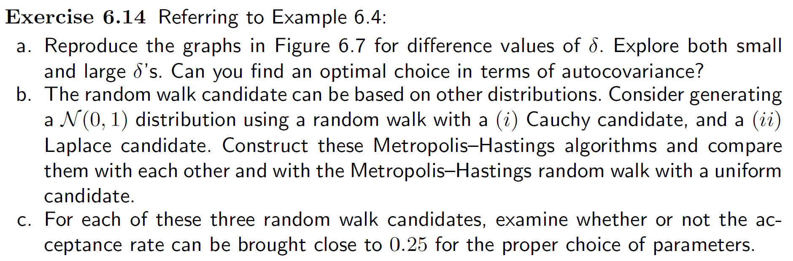

\newcommand*\diff{\mathop{}\mathrm{d}}

```{r setup, include=FALSE}
knitr::opts_chunk$set(echo = TRUE, fig.align='center')
```

```{r, libraries, message = F}
# Libraries
library(tidyverse) 
library(latex2exp) 
library(knitr)
library(rmutil)     # For the Laplace distribution
library(kableExtra) # For kable style table

# Set plot theme
theme_set(theme_bw())
```

# TH-1


_**Assignment**: Markov Chain - Given the transition matrix P (slide 14 of MCMC slides) of a Markov chain, follow the steps described in slide 15 and verify that the stationary distribution is $π=c(.1,.2,.2,.2,.2,.1)$ (slide 16)._

Let's define:
$$Q \triangleq P^t$$

With this definition, $Q$ is a stochastic matrix, i.e. a matrix in which every column represents a discrete probability distribution.

If we consider $\pi^{(s)}, \ s\in \mathbb{N}$ as column vectors:
$$
\pi^{(s)} =
\left(
\begin{array}{c}
\pi_1^{(s)} \\
\vdots \\
\pi_6^{(s)} \\
\end{array}
\right),
\qquad
\sum_{i=1}^{6}{\pi_i^{(s)}=1},
\quad
\pi_i^{(s)}\ge 0 \ \forall i \in \{1,2,\dots,6\} 
$$
we find:
$$
\pi^{(s)} = Q \pi^{(s-1)} = Q^{s} \pi^{(0)}
$$
Let's define:
$$
\pi \triangleq \lim_{s\to +\infty}{\pi^{(s)}}
$$

Given:
$$
Q = 
\left(
\begin{array} \\
\frac{1}{2} & \frac{1}{4} & 0           & 0           & 0           & 0           \\
\frac{1}{2} & \frac{1}{2} & \frac{1}{4} & 0           & 0           & 0           \\
0           & \frac{1}{4} & \frac{1}{2} & \frac{1}{4} & 0           & 0           \\
0           & 0           & \frac{1}{4} & \frac{1}{2} & \frac{1}{4} & 0           \\
0           & 0           & 0           & \frac{1}{4} & \frac{1}{2} & \frac{1}{2} \\
0           & 0           & 0           & 0           & \frac{1}{4} & \frac{1}{2} \\
\end{array}
\right)
$$

for each $\pi^{(0)}$ that satisfy $\sum_{i=1}^{6}{\pi_i^{(s)}=1}, \ \pi_i^{(s)}\ge 0 \ \forall i \in \{1,2,\dots,6\}$, it results:
$$
\pi = 
\left(
\begin{array}{c}
\frac{1}{10} \\
\frac{1}{5}  \\
\frac{1}{5}  \\
\frac{1}{5}  \\
\frac{1}{5}  \\
\frac{1}{10} \\
\end{array}
\right)
$$

In the following plot it is represented the distribution of $\pi_i^{(s)}, \ i \in \{1,2,\dots,6\}$ as a function of $s$ starting from:

$$
\pi^{(0)} =
\left(
\begin{array}{c}
0 \\
0 \\
1 \\
0 \\
0 \\
0 \\
\end{array}
\right)
$$

As we can see, for $s=100$, $\pi^{(s)}$ is already practically equal to $\pi$.

```{r}
P <- matrix(c(.5,.5,0,0,0,0,
           .25,.5,.25,0,0,0,
           0,.25,.5,.25,0,0,
           0,0,.25,.5,.25,0,
           0,0,0,.25,.5,.25,
           0,0,0,0,.5,.5),
         nrow = 6, ncol = 6, byrow = TRUE)
Q = t(P)
Q
```

```{r, ex1_a, cache = T}
# Number of steps in which
# the theoretical distribution \pi^{(s)} is computed
Ncal <- 100

a3 <- matrix(c(0,0,1,0,0,0), ncol = 1)

# a3_dev[,s] corresponds to \pi^{(s)}
a3_dev <- matrix(nrow = 6, ncol = Ncal)

a3_dev[,1] <- a3
for(i in 2:ncol(a3_dev)){
  a3_dev[,i] <- Q%*%a3_dev[,i-1]
}

colnames(a3_dev) <- 1:ncol(a3_dev)

a3_data <- as_tibble(a3_dev) %>% 
  mutate(pos = 1:6) %>% 
  select(pos, everything()) %>% 
  gather(key = "iter", value = "prob",
         2:(ncol(a3_dev)+1)) %>% 
  mutate(pos = factor(pos),
         iter = as.integer(iter))

a3_data %>% 
  filter(iter > 1) %>% 
  ggplot(aes(x = iter, y = prob, color = pos)) +
  geom_point() +
  geom_line() +
  labs(x = TeX("s"), y = TeX("$\\pi^{(s)}$"),
       title = TeX("Convergence of $\\pi^{(s)}$"),
       color = "position")
```

To find empirically this result, we can compute the relative frequency distribution of the realizations of a finite subset of this Markov chain and find that they approach $\pi$.

Let's define:

* $\{x_j\}_{j\in \mathbb{N}}$ a realization of the Markov chain;
* $\hat{\pi}_i^{(s)} = \sum_{j=1}^s{I_{x_j=i}}, \ i\in\{1,2,\dots,6\}$, where $I_{x_j=i}$ is the indicator of the event $\{x_j=i\}$;
* $\hat{\pi}^{(s)} = \left(\hat{\pi}_1^{(s)}, \dots, \hat{\pi}_6^{(s)}\right)^t$.

For the Ergodic Theorem it results:
$$
\hat{\pi}^{(s)} \xrightarrow{s\to + \infty} \pi \quad (\text{in probability})
$$

So we can simulate the first $s$ values of a Markov chain $\{x_j\}_{j\in \mathbb{N}}$ and compute for each step $s$ the relative frequencies $\hat{\pi}^{(s)}$.

In the following plot it is represented $\hat{\pi}^{(s)}$ as a function of $s$, starting from $x_j=3$. As we have seen in the plot before, for small values of $s$, $\pi^{(s)}$ is quite different from $\pi$, so, in order to fasten the convergence of $\hat{\pi}^{(s)}$ we could remove the first values of $x_j$ with a burn-in. In the following code the burn-in hasn't been performed.

As we can see, $\hat{\pi}^{(s)}$ converges to $\pi$, but its convergence is much slower than the convergence of $\pi^{(s)}$.

```{r, ex1_s, cache = T}
# Number of steps in which
# the empirical distribution \hat{\pi}^{(s)} is computed
Nsim <- 1e4

# Realization of the Markov chain
s3 <- integer(length = Nsim)

s3[1] <- 3

set.seed(123)
for (j in 2:Nsim){
  s3[j] = sample(1:6, size=1, prob = P[s3[j-1],])
}

s3_dev <- matrix(0,
                 nrow = 6, ncol = Nsim)

s3_dev[s3[1], 1] <- 1

for(i in 2:ncol(s3_dev)){
  s3_dev[,i] <- s3_dev[,i-1]
  s3_dev[s3[i],i] <- s3_dev[s3[i],i] + 1
}

colnames(s3_dev) <- 1:ncol(s3_dev)

s3_data <- as_tibble(s3_dev) %>% 
  mutate(pos = 1:6) %>% 
  select(pos, everything()) %>% 
  gather(key = "iter", value = "count",
         2:(ncol(s3_dev)+1)) %>% 
  mutate(pos = factor(pos),
         iter = as.integer(iter)) %>% 
  group_by(iter) %>% 
  mutate(freq = count/sum(count)) %>% 
  ungroup()

s3_data %>% 
  filter(iter > 1) %>% 
  ggplot(aes(x = iter, y = freq, color = pos)) +
  geom_hline(yintercept = c(.1, .2)) +
  geom_point(size = .5) +
  geom_line() +
  labs(x = TeX("s"), y = TeX("$\\hat{\\pi}^{(s)}$"),
       title = TeX("Realization of $\\hat{\\pi}^{(s)}$"),
       color = "position") +
  coord_cartesian(xlim = c(0,Nsim), ylim = c(0, .5))
```


# TH-2

_**Assignment**: An insect deposits $N$ eggs and each one is seeded with probability $\theta$. The probability $\theta$ varies from insect to insect, as well as the number of deposited eggs. Assuming that the number of deposited eggs $N$ follows a Poisson distribution of parameter $\lambda$ and that the probability of insemination $\theta$ follows a Beta distribution of parameters $\alpha, \beta$, with $N$ and $\theta$ independent of each other._

Under our hypothesis we have for $N$:
$$
\begin{align}
\pi_N(n) &\triangleq Pr(N=n) = \frac{\lambda^n e^{-\lambda}}{n!} \\
E(N)     &= \lambda \\
Var(N)   &= \lambda \\
E(N^2)   &= \lambda + \lambda^2 \\
\end{align}
$$

and for $\theta$:
$$
\begin{align}
\pi_\theta(t) &= \frac{\Gamma(\alpha+\beta)}{\Gamma(\alpha)\Gamma(\beta)}t^{\alpha-1}(1-t)^{\beta-1} \\
E(\theta)     &= \frac{\alpha}{\alpha+\beta} \\
Var(\theta)   &= \frac{\alpha \beta}{(\alpha+\beta)^2(\alpha+\beta+1)} \\
E(\theta^2)   &= \frac{\alpha(\alpha+1)}{(\alpha+\beta)(\alpha+\beta+1)} \\
\end{align}
$$

These results are used in section [TH-2.2] to compute $E(X)$ and $Var(X)$.


## TH-2.1
_Determine the distributions of each of the 3 conditioned variables to the other 2. In particular, show that:_

* $\left(X|N=n,θ=t\right) \ \sim \ \mathcal{Binomial}(n,t)$;
* $\left(θ|N=n,X=x\right) \ \sim \ \mathcal{Beta}(α+x,β+n−x)$;
* $\left(N−x|X=x,θ=t\right) \ \sim \ \mathcal{Poisson}(λ(1−t))$.


### TH-2.1.1 Distribution of $X|N=n,θ=t$

It results:

$$
\left(X|N=n,θ=t\right) \ \sim \ \mathcal{Binomial}(n,t)
$$

#### Proof

Let's define:
$$
Y_i \triangleq
\begin{cases}
1 & \text{if the egg } i \text{ is seeded} \\
0 & \text{otherwise}
\end{cases}
\qquad
i\in \mathbb{N}
$$

So we can find $X$ as:
$$
X = \sum_{i=1}^{N}{Y_i}
$$

Under our hypothesis, we get
$$
Pr(Y_i|H) = \theta, \ \forall i \in \{1,2,\dots\}
$$

where $H$ is any events belonging to the $\sigma$-Algebra defined by $N$ such as $H \rightarrow \{N\ge i\}$. In particular $Pr(Y_i|N\ge i) = \theta$.

So, fixed a certain $\bar{n}\in\{1,2,\dots\}$, conditioned to $\{N\ge\bar{n}\}$, we get:
$$
\left(Y_i | N\ge\bar{n}\right) \ \sim \ \mathcal{Binomial}(1, \theta), \qquad \forall i \in \{1,\dots,\bar{n}\}
$$

and conditioned to $\theta = t$:
$$
\left(Y_i | \theta = t,  N\ge\bar{n}\right) \ \sim \ \mathcal{Binomial}(1, t), \qquad \forall i \in \{1,\dots,\bar{n}\}
$$

Let's assume that for every fixed $n$:
$$
\left(Y_1| \theta = t, H\right), \ \left(Y_2| \theta = t, H\right), \ \dots,
\ \left(Y_n| \theta = t, H\right) \text{ are independent}
$$
for every events $H$ belonging to the $\sigma$-Algebra defined by $N$ such as $H \rightarrow \{N\ge n\}$.

In particular this statement implies that for every fixed $n$:
$$
\left(Y_1| \theta = t, N=n\right), \ \left(Y_2| \theta = t, N=n\right), \ \dots,
\ \left(Y_n| \theta = t, N=n\right) \text{ are independent}
$$

Under this assumption, $X| \theta = t, N = n$ is sum of $n$ independent equally distributed bernoullian variables $Y_i$, so it results:
$$
\left( X| \theta = t, N=n \right) =
\left(\sum_{i=1}^{N}{Y_i} \ \bigg| \ \theta = t, N=n \right) =
\sum_{i=1}^{N}{\left(Y_i | \theta = t, N=n \right)} \sim \mathcal{Binomial}(n, t)
$$

Note that the hypothesis of independence of $Y_1, \dots, Y_n$ given $N=n$ and $\theta=t$ was needed to find the result $X \sim \mathcal{Binomial}(n, t)$. Without this hypothesis (i.e. if the $Y_i|\theta=t, N=n$ were correlated), the distribution of $X$ wouldn't be binomial.

So it results:
$$
p_X(x\mid N=n, \theta = t) = {n \choose x} t^x (1-t)^{n-x}
$$


### TH-2.1.2 Distribution of $θ|N=n,X=x$ {#refTh212}

It results:

$$
\left(θ|N=n,X=x\right) \ \sim \ \mathcal{Beta}(α+x,β+n−x)
$$

#### Proof

$$
\begin{align}
\pi_\theta(\theta|x,n) &= \frac{p_X(x|\theta, n) \overbrace{\pi_\theta(\theta|n)}^{\pi_\theta(\theta)}}{p_X(x|n)} \\
&= \frac{p_X(x|\theta, n) \pi_\theta(\theta)}{p_X(x|n)} \\
&\propto p_X(x|\theta, n) \pi_\theta(\theta) \\
&= {n \choose x} \theta^x (1-\theta)^{n-x} \ 
\frac{\Gamma(\alpha+\beta)}{\Gamma(\alpha)\Gamma(\beta)}\theta^{\alpha-1}(1-\theta)^{\beta-1} \\
&\propto \theta^{\alpha+x-1}(1-\theta)^{\beta+n-x-1}
\end{align}
$$

We have found that $\pi_\theta(\theta|x,n)$ is proportional to $\theta^{\alpha+x-1}(1-\theta)^{\beta+n-x-1}$, that is the kernel of a $\mathcal{Beta}(\alpha+x, \beta+n-x)$.

Therefore:
$$
\left(θ|N=n,X=x\right) \ \sim \ \mathcal{Beta}(α+x,β+n−x)
$$

We can see that:
$$
\begin{align}
E\left(θ|N=n,X=x\right) &= \frac{\alpha+x}{\alpha+\beta+n} \\
&= \underbrace{\frac{\alpha}{\alpha+\beta}}_{E(\theta)} \frac{\alpha+\beta}{\alpha+\beta+n}
+ \underbrace{\frac{x}{n}}_{\hat{\theta}_{ML}} \frac{n}{\alpha+\beta+n}
\end{align}
$$
Where $\hat{\theta}_{ML}$ is the Maximum Likelihood estimator for $\theta$ given the observation of $N$ and $X$.


### TH-2.1.3 Distribution of $N−x|X=x,θ=t$

It results:

$$
\left(N−x|X=x,θ=t\right) \ \sim \ \mathcal{Poisson}(λ(1−t))
$$

#### Proof

$$
\begin{align}
\pi_N(n\mid x,\theta) &= \frac{p_X(x|n,\theta)\overbrace{\pi_N(n|\theta)}^{\pi_N(n)}}{p_X(x|\theta)} \\
&= \frac{p_X(x|n,\theta)\pi_N(n)}{p_X(x|\theta)} \\
&\propto p_X(x|n,\theta)\pi_N(n) \\
&= {n \choose x} \theta^x(1-\theta)^{n-x} \ \frac{\lambda^n e^{-\lambda}}{n!} \\
&= \frac{n!}{x!(n-x)!}\theta^x (1-\theta)^n (1-\theta)^{-x} \frac{\lambda^n e^{-\lambda}}{n!} \\
&= \underbrace{\frac{\theta^x(1-\theta)^{-x}}{x!}e^{-\lambda}}_{\text{doesn't depend from }n}
\ \frac{\left[\lambda(1-\theta)\right]^n}{(n-x)!} \\
&\propto \frac{\left[\lambda(1-\theta)\right]^n}{(n-x)!} \\
&\propto \frac{\left[\lambda(1-\theta)\right]^n}{(n-x)!} 
\ \underbrace{\left[\lambda(1-\theta)\right]^{-x} e^{-\lambda(1-\theta)}}_{\text{doesn't depend from }n} \\
&= \frac{\left[\lambda(1-\theta)\right]^{n-x}e^{-\lambda(1-\theta)}}{(n-x)!}
\end{align}
$$

Therefore:
$$
\begin{align}
Pr(N-x = n' \mid X=x, \theta=t) &= Pr(N = n'+x \mid X=x, \theta=t) \\
&= \pi_N(n'+x \mid x, \theta) \\
&= \frac{\left[\lambda(1-\theta)\right]^{n'}e^{-\lambda(1-\theta)}}{n'!}
\end{align}
$$

So we find:
$$
\left(N−x|X=x,θ=t\right) \ \sim \ \mathcal{Poisson}(λ(1−t))
$$

## TH-2.2
_Draw, using Gibbs sampler, a sample of $(n,θ,x)$ and graphically represent the distribution of seeded eggs $X$, then compare the theoretical mean and variance of $X$ with the ones computed on the simulated sample._

```{r, gibbs_func, cache = T}
# Function that performs the Gibbs sampling algorithm
gs <- function(Nsim, l, a, b){
  theta = numeric(length = Nsim)
  n = numeric(length = Nsim)
  x = numeric(length = Nsim)
  
  theta[1] <- a/(a+b)
  n[1] <- round(l, 0)
  x[1] <- round(l*a/(a+b), 0)
  
  for(i in 2:Nsim){
    theta[i] <- rbeta(n = 1,
                      shape1 = a + x[i-1],
                      shape2 = b + n[i-1] - x[i-1])
    n[i] <- x[i-1] + rpois(n=1,
                           lambda = l*(1-theta[i]))
    x[i] <- rbinom(n = 1,
                   size = n[i],
                   prob = theta[i])
  }
  
  samples <- tibble(theta, n, x)
  
  return(samples)
}
```

The values chosen to compute the simulation are:
$$
\begin{align}
\lambda &= 100 \\
\alpha  &= 6 \\
\beta   &= 4 \\
\end{align}
$$

```{r, gibbs_sim, cache = T}
# Parameters for the marginal distributions
l <- 100
a <- 6
b <- 4

# Number of simulated values with the Gibbs sampling algorithm
Nsim <- 1e6

set.seed(123)
samples <- gs(Nsim = Nsim, l = l, a = a, b = b)
```

In the following plot it is represented the empirical distribution of $X$ sampled with the Gibbs sampling algorithm. The black line is a kernel density estimation for the distribution of $X$ computed from the sample.

```{r, gibbs_plot, cache = T}
samples %>% 
  count(x) %>% 
  mutate(freq = n/sum(n)) %>% 
  ggplot() +
  geom_segment(aes(x = x, y = freq,
                   xend = x, yend = 0), size = 1) +
  geom_density(data = samples, aes(x = x),
               size = 1) +
  labs(title = "Sample for X",
       subtitle = str_c("Nsim = ", Nsim))
```

The marginal mean and variance of $X$ can be computed as:
$$
\begin{align}
E(X) &= E\left[E(X\mid\theta,N)\right] \\
Var(X) &= \underbrace{Var\left[E(X\mid\theta,N)\right]}_{\text{Explained Variance}} +
\underbrace{E\left[Var(X\mid\theta,N)\right]}_{\text{Residual Variance}}
\end{align}
$$

Given the assumptions of the problem, we have that the marginal mean of $X$ is:
$$
\begin{align}
E(X) &= E[\underbrace{E(X\mid\theta,N)}_{N\theta}] \\
&= E[N\theta] \\
&= E[N] E[\theta] \\
&= \lambda \frac{\alpha}{\alpha+\beta}
\end{align}
$$
In particular:

* the equivalence $E(X\mid\theta,N) = N\theta$ is due to the sampling method for $X$ given $N$ and $\theta$;
* the equivalence $E[N\theta] = E[N] E[\theta]$ is due to the hypothesis of independence of $N$ and $\theta$.

The marginal variance can be found computing separately the 2 components:

$$
\begin{align}
Var(X) &= \underbrace{Var\left[E(X\mid\theta,N)\right]}_{\text{Explained Variance}} +
\underbrace{E\left[Var(X\mid\theta,N)\right]}_{\text{Residual Variance}}
\end{align}
$$


##### Explained Variance

As we already found $E(X|N\theta) = N\theta$, so:
$$
\begin{align}
Var\left[E(X\mid\theta,N)\right] &=
E\left[E(X|N\theta)^2\right] - E\left[E(X|N\theta)\right]^2 \\
&= \underbrace{E[(N\theta)^2]}_{E[N^2] E[\theta^2]} - {\underbrace{E[N\theta]}_{E[N] E[\theta]}}^2 \\
&= E[N^2] E[\theta^2] - E[N]^2 E[\theta]^2 \\
&= (\lambda+\lambda^2)E[\theta^2] - \lambda^2E[\theta]^2 \\
&= \lambda E[\theta^2] + \lambda^2 (\underbrace{E[\theta^2] - E[\theta]^2}_{Var[\theta]}) \\
&= \lambda\left(
\frac{\alpha(\alpha+1)}{(\alpha+\beta)(\alpha+\beta+1)}
+ \lambda \frac{\alpha \beta}{(\alpha+\beta)^2(\alpha+\beta+1)}
\right) \\
&= \lambda
\cdot \frac{\alpha}{(\alpha+\beta)(\alpha+\beta+1)}
\cdot \left( \alpha+1 + \lambda\frac{\beta}{\alpha+\beta} \right)
\end{align}
$$
In particular, the equivalences $E[N\theta] = E[N] E[\theta]$ and $E[N^2\theta^2] = E[N^2] E[\theta^2]$ are due to the hypothesis of independence of $N$ and $\theta$.


##### Residual Variance:

$Var(X \mid \theta, N)$ can be found as:
$$
\begin{align}
Var(X \mid \theta, N) &= N \theta (1-\theta) \\
&= N\theta - N\theta^2
\end{align}
$$

Therefore:
$$
\begin{align}
E[Var(X \mid \theta, N)] &= E[N\theta - N\theta^2] \\
&= E[N\theta] - E[N\theta^2] \\
&= E[N]E[\theta] - E[N]E[\theta^2] \\
&= E[N]\left(E[\theta] - E[\theta^2]\right) \\
&= \lambda \left(
\frac{\alpha}{\alpha+\beta} - \frac{\alpha (\alpha+1)}{(\alpha+\beta)(\alpha+\beta+1)}
\right) \\
&= \lambda \frac{\alpha}{\alpha+\beta} \left(
1 - \frac{\alpha+1}{\alpha+\beta+1}
\right) \\
&= \lambda \frac{\alpha \beta}{(\alpha+\beta)(\alpha+\beta+1)}
\end{align}
$$

In particular, the equivalences $E[N\theta] = E[N] E[\theta]$ and $E[N\theta^2] = E[N] E[\theta^2]$ are due to the hypothesis of independence of $N$ and $\theta$.

In the following table we can see the comparison between the empirical and the theoretical mean and variance for $N$, $\theta$ and $X$. As we can see, the empirical quantities are quite close to the theoretical ones.

```{r, gibbs_stats}
# Theoretical variance for X
var_bw <- l*a/((a+b)*(a+b+1))*(a+1+l*b/(a+b))
var_wi <- l*a*b/((a+b)*(a+b+1))

samples %>% 
  gather(key = "variable", value = "value") %>% 
  group_by(variable) %>% 
  summarize(mean_emp = mean(value),
            var_emp = var(value)) %>% 
  mutate(mean_th = c(l, a/(a+b), l*a/(a+b)),
         var_th = c(l, a*b/((a+b)^2*(a+b+1)), var_bw+var_wi)) %>% 
  knitr::kable(digits = 2) %>% 
  kable_styling(bootstrap_options = c("striped", "hover", "condensed"),
                full_width = F)
```


## TH-2.3
_Verify that the simulated conditional distribution of $θ$ given $N=\hat{n}$ and $X=\hat{x}$, where $\hat{n}$ and $\hat{x}$ are posterior estimates, corresponds with the theoretical one._

In our problem we can't talk about posterior estimates because there is no observation, but just a sample from a prior joint distribution of $(N, \theta, X)$. Furthermore, as soon as $N$ and $\theta$ vary from insect to insect, they are not parameters, but they are random variable with a certain variability between the insects. Thus, for example, we can't talk of $N$ as a parameter with a posterior estimation $\hat{n}$.

Anyway, we can think to the simulate sample as a set of observations and we can define $\hat{n}$ and $\hat{x}$ as the maximum likelihood estimators for $E[N]$ and $E[X]$. We could consider them as posterior estimates of $E[N]$ and $E[X]$ if we gave a prior distribution to the parameters $\lambda$, $\alpha$ and $\beta$.

Another problem that incurs is that if we define $\hat{n}$ as the maximum likelihood estimate for $E[N]$ and $\hat{x}$ as the maximum likelihood estimate for $E[X]$, they could be non integer values, so it wouldn't make sense to condition to $N=\hat{n}$ and $X=\hat{x}$. In order to find reasonable values for $\hat{n}$ and $\hat{x}$, I defined $\hat{n}$ as the integer closest to the maximum likelihood estimate for $E[N]$ and $\hat{x}$ as the integer closest to the maximum likelihood estimate for $E[X]$.

As we can see, it results that $\hat{n}$ is equal to $E[N]=\lambda$ and $\hat{x}$ is equal to $E[X]=\lambda\frac{\alpha}{\alpha+\beta}$. This was expected because our observed data is just a sample from the joint distribution of $(N, \theta, X)$ and the sample size is quite big (`r Nsim` observations).

```{r, gibbs_hat1, cache = T}
n_hat = round(mean(samples$n),0)
x_hat = round(mean(samples$x))
```

```{r, gibbs_hat2, cache = T}
n_hat
x_hat
```

As demonstrated in section [TH-2.1.2](#refTh212), the conditional distribution for $θ|N=\hat{n},X=\hat{x}$ is:
$$
\left(θ|N=\hat{n},X=\hat{x}\right) \ \sim \ \mathcal{Beta}(α+\hat{x},β+\hat{n}−\hat{x})
$$

To get a sample of $\theta\mid N=\hat{n}, X=\hat{x}$, we can just filter the simulated data considering just the tuples $(n_i, \theta_i, x_i)$ such as $n_i=\hat{n} \ \land \ x_i = \hat{x}$.

There are $`r sum(samples$n == n_hat & samples$x == x_hat)`$ observations with $n_i=\hat{n}$ and $x_i=\hat{x}$ over a total of $`r Nsim`$ observations.

In the following plot it is represented the histogram of the sample of $\left(θ|N=\hat{n},X=\hat{x}\right)$. The black line is a kernel density estimation for the distribution of $\left(θ|N=\hat{n},X=\hat{x}\right)$ computed from the sample and the red line is the theoretical distribution of $\left(θ|N=\hat{n},X=\hat{x}\right)$.

```{r, gibbs_hat_plot, warning = F, cache = T}
samples %>% 
  filter(n == n_hat,
         x == x_hat) %>%
  ggplot(aes(x = theta)) +
  geom_histogram(aes(y = ..density..),
                 binwidth = .02) +
  geom_density(size = 1) +
  scale_x_continuous(limits = c(0,1)) +
  stat_function(fun = function(x){dbeta(x, a + x_hat, b + n_hat - x_hat)},
                color = "red",
                size = 1) +
  labs(x = TeX("$\\theta$"), y = "density",
       title = TeX("Distribution of $\\theta |N=\\hat{n}, X=\\hat{x}$"),
       subtitle = str_c("Nsim = ", Nsim))
```


# MCR-1
_**Assignment**: Random walk Metropolis-Hastings_ 

```{r, out.width = "600px", echo = F}

```


## a

### Reproduce graph

```{r, mh_func}
# Function that performs the Metropolis-Hastings algorithm
mh <- function(Nsim, g){
  n = 0
  
  x <- numeric(length = Nsim)
  
  x[1] <- 0
  
  for(s in 2:Nsim){
    # cand <- runif(1, min = -d, max = d) + x[s-1]
    cand <- g() + x[s-1]
    
    R <- dnorm(cand) / dnorm(x[s-1])
    
    rho <- min(R, 1)
    
    if(runif(1) <= rho){
      x[s] <- cand
      n <- n+1
    } else{
      x[s] <- x[s-1]
    }
    
  }
  l <- list(x = x,
            n = n,
            Nsim = Nsim)
  return(l)
}
```

```{r, mh_unif_perf}
# Number of simulations
Nsim <- 5000

# Parameter delta
d <- c(.1, 1, 10)

# Proposal distributions
g <- list()
for(i in 1:length(d)){
  g[[i]] <- function(){runif(1, min = -d[i], max = d[i])}
}

# Simulations
mh_sim <- list()

for(i in 1:length(d)){
  set.seed(123)
  mh_sim[[i]] <- mh(Nsim = Nsim, g = g[[i]])
}

# Acceptance ratio
acc_ratio <- numeric(length = length(mh_sim))

for(i in 1:length(mh_sim)){
  acc_ratio[i] <- mh_sim[[i]]$n/mh_sim[[i]]$Nsim
}

tibble(d, acc_ratio) %>% 
  kable(digits = 2) %>% 
  kable_styling(bootstrap_options = c("striped", "hover", "condensed"),
                full_width = F)
```


```{r, plot_funct}
# Function that computes the plots
plot_mh <- function(mh_sim, title){
  
  # Limits on the horizontal axis of the histograms
  lim <- 0

  for(m in mh_sim){
    lim <- max(lim, abs(m$x))
  }

  lim <- ceiling(10*lim)/10
  
  bins <- seq(from = -lim, to = lim, by = .1)
  last = 500

  # Limits on the vertical axis of the chain plot
  lim2 <- 0

  for(m in mh_sim){
    lim2 <- max(lim2, abs(m$x[(m$Nsim-500):m$Nsim]))
  }

  lim2 <- ceiling(10*lim2)/10


  par(mfcol = c(3,length(mh_sim)),
      mar = c(4,4,3,3))

  for(i in 1:length(mh_sim)){
    m <- mh_sim[[i]]
    
    # chain plot
    plot(x = (m$Nsim-500):m$Nsim,
         y = m$x[(m$Nsim-500):m$Nsim],
         ylim = c(-lim2, lim2),
        type = "l",
        xlab = "index", ylab = "x",
        main = str_c(title[i],
                      ", acc. rate = ", round(m$n/m$Nsim,2)))
  
    # histogram
    hist(m$x,
         # breaks = nbins,
         breaks = bins,
        freq = F,
        main = "", xlab = "x", ylab = "density",
        xlim = c(-lim, lim),
        ylim = c(0, .7))
    curve(dnorm(x),
          add = T,
          lwd = 2)
  
    # auto-correlation plot
    acf(m$x,
        main = "")
  }

  par(mfcol = c(1,1))
}
```


In the following plot there are represented the sequence of generated values, the histogram and the auto-correlation function for the data generated with the Metropolis Hastings algorithm. The proposal distribution used are $\mathcal{Unif}(-\frac{1}{10}, \frac{1}{10})$, $\mathcal{Unif}(-1,1)$ and $\mathcal{Unif}(-10,10)$. As we can see from the histograms, the values generated with a proposal $\mathcal{Unif}(-1,1)$ are clearly the ones that better fit the normal distribution.

```{r, plot_unif}
title <- str_c("Unif(-", d, ", ", d, ")")

plot_mh(mh_sim = mh_sim, title = title)
```


### Optimal value for $\delta$

To find the optimal value for $\delta$ we can perform a grid search over several possible values. I used as grid all the values in $\{0.1, 0.2, \dots, 9.9, 10\}$.

To choose the optimal values for $\delta$, I used the criteria described in _Introducing Monte Carlo Methods with R_:

1. take the value of $\delta$ that brings to an acceptance ratio of $50\%$;
2. take the value of $\delta$ that brings to an acceptance ratio of $25\%$.


```{r, best_delta_1}
# Grid for delta
d <- seq(from = .1, to = 10, by = .1)

# Proposal distributions
g <- list()
for(i in 1:length(d)){
  g[[i]] <- function(){runif(1, min = -d[i], max = d[i])}
}

# Simulations
mh_sim <- list()

set.seed(123)
for(i in 1:length(d)){
  mh_sim[[i]] <- mh(Nsim = Nsim, g = g[[i]])
}

# Acceptance ratio
acc_rate <- numeric(length = length(mh_sim))
for(i in 1:length(mh_sim)){
  acc_rate[i] <- mh_sim[[i]]$n/mh_sim[[i]]$Nsim
}

data_acc <- tibble(d, acc_rate)
```

In the following plot there are represented the values of the acceptance ratio for different values of $\delta$. As we can see, increasing the value of $\delta$ (and so increasing the dispersion of the proposal distribution), the acceptance ratio decreases.

```{r, best_delta_1.2}
plot(data_acc$d, data_acc$acc_rate,
     type = "o", xlab = TeX("$\\delta$"), ylab = "Acc. rate",
     main = TeX("Acc. rate varying $\\delta$ in the Uniform"))
```

```{r, best_delta_2}
best_acc_rate <- which.min((data_acc$acc_rate - .5)^2)

best_acc_rate2 <- which.min((data_acc$acc_rate - .25)^2)
```

The value of $\delta$ that brings to the closer to $50\%$ acceptance ratio within the ones tried in the grid search is `r d[best_acc_rate]` and the one that brings to the closer to $25\%$ is `r d[best_acc_rate2]`.

```{r, best_delta_2.1}
data_acc %>% 
  filter(row_number() == best_acc_rate | row_number() == best_acc_rate2) %>% 
  kable(digits = 2) %>% 
  kable_styling(bootstrap_options = c("striped", "hover", "condensed"),
                full_width = F)
```


Plotting the data simulated from the Metropolis-Hastings algorithm, we can see that:

* considering the auto-correlation function, the samples with acceptance ratio of $50\%$ and $25\%$ are less auto-correlated than the one with $\delta = 1$;
* considering the histogram, the sample with $\delta = 1$, that has a greater acceptance ratio, looks slightly better. The better fit of this sample compared to the others could be due to the fact that we simulated just `r Nsim` values. If the acceptance ratio is smaller, there are a lot of equal consecutive values (that bring to the picks in the histograms), so, to smoothly fit the density function with the histogram, more simulations are needed. Probably with a bigger number of simulations, the samples simulated with a proposal distribution that brings to an acceptance ratio of $50\%$ and $25\%$ would better fit the theoretical distribution.

```{r, best_delta_3}
d <- c(1,
       data_acc$d[best_acc_rate],
       data_acc$d[best_acc_rate2])

# Proposal distributions
g <- list()
for(i in 1:length(d)){
  g[[i]] <- function(){runif(1, min = -d[i], max = d[i])}
}

# Simulations
mh_sim <- list()

for(i in 1:length(d)){
  set.seed(123)
  mh_sim[[i]] <- mh(Nsim = Nsim, g = g[[i]])
}

title <- str_c("Unif(-", d, ", ", d, ")")
plot_mh(mh_sim = mh_sim, title = title)
```


## b

In the following code, the Metropolis-Hastings algorithm has been performed with the following proposal distributions:

* $\mathcal{Unif}(-1,1)$
* $\mathcal{Cauchy}(1)$ 
* $\mathcal{Laplace}(1)$

```{r, mh_caLa_perf}
# Proposal distributions
g <- list()

g[[1]] <- function(){runif(1, min = -1, max = 1)}
g[[2]] <- function(){rcauchy(1)}
g[[3]] <- function(){rlaplace(1)}

# Simulations
mh_sim <- list()

for(i in 1:length(g)){
  set.seed(123)
  mh_sim[[i]] <- mh(Nsim = Nsim, g = g[[i]])
}

# Acceptance ratio
acc_ratio <- numeric(length = length(mh_sim))

for(i in 1:length(mh_sim)){
  acc_ratio[i] <- mh_sim[[i]]$n/mh_sim[[i]]$Nsim
}

title <- c("Unif(-1,1)",
           "Cauchy(1)",
           "Laplace(1)")

tibble(title, acc_ratio) %>% 
  kable(digits = 2) %>% 
  kable_styling(bootstrap_options = c("striped", "hover", "condensed"),
                full_width = F)
```


```{r, plot_caLa}
plot_mh(mh_sim = mh_sim, title = title)
```


## c

In the following code, the grid search to find the optimal values for the scale parameters of the Cauchy and the Laplace proposal distributions is reported. The criteria used are the same used to find the best $\delta$ for the Uniform proposal distribution.

The results we find here are similar to the ones found for the Uniform distribution, so the previous observations can be referred to the Cauchy and Laplace distributions as well.

### Optimal parameter for the Cauchy distribution

```{r, best_ca_1}
scale <- seq(from = .1, to = 10, by = .1)

# Proposal distributions
g <- list()
for(i in 1:length(scale)){
  g[[i]] <- function(){rcauchy(1, scale = scale[i])}
}

# Simulations
mh_sim <- list()

for(i in 1:length(scale)){
  set.seed(123)
  mh_sim[[i]] <- mh(Nsim = Nsim, g = g[[i]])
}

# Acceptance ratio
acc_rate <- numeric(length = length(mh_sim))
for(i in 1:length(mh_sim)){
  acc_rate[i] <- mh_sim[[i]]$n/mh_sim[[i]]$Nsim
}

data_acc <- tibble(scale, acc_rate)

plot(data_acc$scale, data_acc$acc_rate,
     type = "o", xlab = "scale", ylab = "Acc. rate",
     main = "Acc. rate varying the scale in the Cauchy")
```


```{r, best_ca_2}
best_acc_rate <- which.min((data_acc$acc_rate - .5)^2)

best_acc_rate2 <- which.min((data_acc$acc_rate - .25)^2)

data_acc %>% 
  filter(row_number() == best_acc_rate | row_number() == best_acc_rate2) %>% 
  kable(digits = 2) %>% 
  kable_styling(bootstrap_options = c("striped", "hover", "condensed"),
                full_width = F)
```


```{r, best_ca_3}
scale <- c(1,
           data_acc$scale[best_acc_rate],
           data_acc$scale[best_acc_rate2])

# Proposal distributions
g <- list()
for(i in 1:length(scale)){
  g[[i]] <- function(){rcauchy(1, scale = scale[i])}
}

# Simulations
mh_sim <- list()

for(i in 1:length(scale)){
  set.seed(123)
  mh_sim[[i]] <- mh(Nsim = Nsim, g = g[[i]])
}

title <- str_c("Cauchy(", scale, ")")
plot_mh(mh_sim = mh_sim, title = title)
```


### Optimal parameter for the Laplace distribution

```{r, best_la_1}
s <- seq(from = .1, to = 10, by = .1)

# Proposal distributions
g <- list()
for(i in 1:length(s)){
  g[[i]] <- function(){rlaplace(1, s = s[i])}
}

# Simulations
mh_sim <- list()

for(i in 1:length(s)){
  set.seed(123)
  mh_sim[[i]] <- mh(Nsim = Nsim, g = g[[i]])
}

# Acceptance ratio
acc_rate <- numeric(length = length(mh_sim))
for(i in 1:length(mh_sim)){
  acc_rate[i] <- mh_sim[[i]]$n/mh_sim[[i]]$Nsim
}

data_acc <- tibble(s, acc_rate)

plot(data_acc$s, data_acc$acc_rate,
     type = "o", xlab = "scale", ylab = "Acc. rate",
     main = "Acc. rate varying the scale in the Laplace")
```


```{r, best_la_2}
best_acc_rate <- which.min((data_acc$acc_rate - .5)^2)

best_acc_rate2 <- which.min((data_acc$acc_rate - .25)^2)

data_acc %>% 
  filter(row_number() == best_acc_rate | row_number() == best_acc_rate2) %>% 
  kable(digits = 2) %>% 
  kable_styling(bootstrap_options = c("striped", "hover", "condensed"),
                full_width = F)
```


```{r, best_la_3}
s <- c(1,
       data_acc$s[best_acc_rate],
       data_acc$s[best_acc_rate2])

# Proposal distributions
g <- list()
for(i in 1:length(s)){
  g[[i]] <- function(){rlaplace(1, s = s[i])}
}

# Simulations
mh_sim <- list()

for(i in 1:length(s)){
  set.seed(123)
  mh_sim[[i]] <- mh(Nsim = Nsim, g = g[[i]])
}

title <- str_c("Laplace(", s, ")")
plot_mh(mh_sim = mh_sim, title = title)
```

